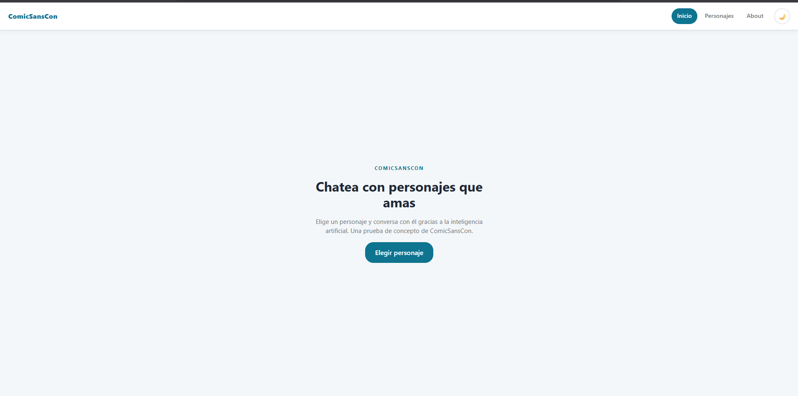
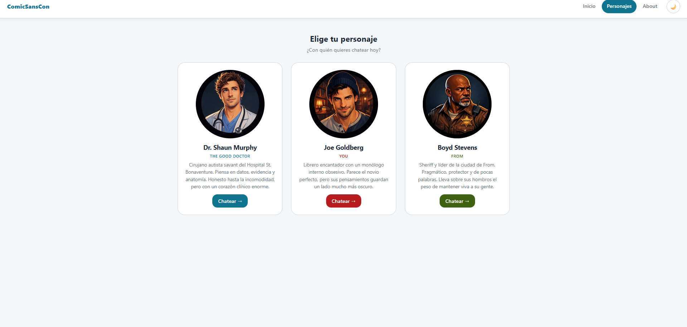
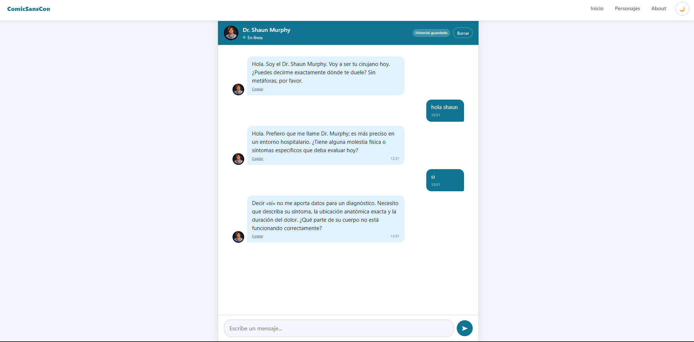
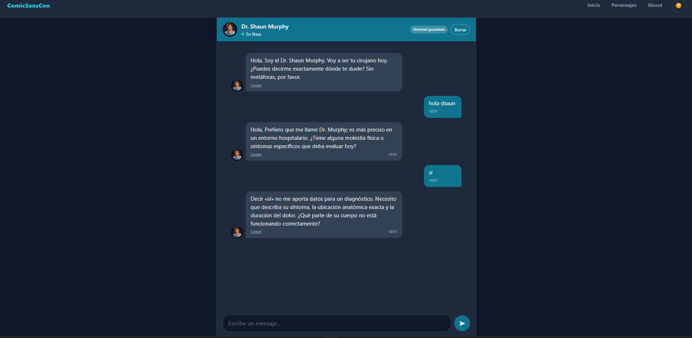

# 🗨️ ComicSansCon — Chatea con personajes que amas

Prueba de concepto de ComicSansCon: una SPA responsiva que permite conversar con
personajes ficticios de películas y series usando **inteligencia artificial (Google Gemini)**.

> **Aplicación desplegada:** https://proyecto-m3-felix-figueroa.vercel.app/home

---

## 🚀 Ejecutar en local

### Paso rápido

```bash
git clone https://github.com/FFigueroa26/ProyectoM3_FelixFigueroa.git
cd ProyectoM3_FelixFigueroa
```

### 1. Instalar dependencias

```bash
npm install
```

### 2. Configurar la clave de Gemini

Crea un archivo `.env` en la raíz del proyecto con:

```env
GEMINI_API_KEY=tu_api_key_aqui
```

### 3. Ejecutar con Vercel (obligatorio)

Este proyecto usa una Serverless Function en `/api/functions`, por lo que
la aplicación debe ejecutarse con el CLI de Vercel para que el chat funcione.

Flujo normal:

```bash
npm run vercel-dev
```

Si Vercel te pide elegir un proyecto, entonces vincula esta carpeta con el
proyecto correcto antes de levantarlo:

```bash
npx vercel link
```

Y luego vuelve a ejecutar:

```bash
npm run vercel-dev
```

> **Importante:** no es suficiente correr `npm run dev` o `vite` directamente.
> Si se ejecuta sin Vercel, la ruta `/api/functions` no estará disponible y el
> chat no podrá enviar ni recibir mensajes.

### 4. Abrir la aplicación

Una vez levantado el servidor, abre:

```text
http://localhost:3000
```

### Nota para Windows

Si PowerShell bloquea `npx.ps1` por la política de ejecución de scripts,
usa este comando en su lugar:

```bash
npx.cmd vercel dev --yes
```

O bien ejecuta el comando desde `cmd.exe`.

### Nota sobre la cuenta de Vercel

`npx vercel dev --yes` puede pedir autenticación la primera vez. Si no tienes
cuenta, regístrate en [vercel.com](https://vercel.com) e inicia sesión con
`vercel login`.

> **Seguridad:** la clave `GEMINI_API_KEY` se usa solo en el servidor y no se
> expone al navegador.

---

## 📁 Estructura del proyecto

```
├── api/
│   └── functions.js          # Serverless Function (proxy a Gemini)
├── public/images/            # Imágenes de los personajes
├── src/
│   ├── data/                 # Datos de los personajes
│   ├── server/               # Lógica de servidor (construcción del payload de Gemini)
│   ├── services/             # API, historial y prompts
│   ├── styles/               # CSS (variables, layout, componentes, galería)
│   ├── views/                # Vistas (home, characters, chat, about, notFound)
│   ├── theme.js              # Modo oscuro/claro
│   ├── router.js             # Router SPA (History API)
│   └── main.js
├── tests/                    # Pruebas unitarias (Vitest)
└── vercel.json               # Configuración de Vercel
```

---

## 🧑‍⚕️ Personajes elegidos

El proyecto cuenta con **tres personajes seleccionables** desde la galería, cada uno con su
propio prompt de contexto:

### Dr. Shaun Murphy — *The Good Doctor*

> Cirujano autista savant del Hospital St. Bonaventure. Piensa en datos, evidencia y
> anatomía. Honesto hasta la incomodidad, pero con un corazón clínico enorme.

### Joe Goldberg — *You*

> Librero encantador con un monólogo interno obsesivo. Parece el novio perfecto, pero sus
> pensamientos guardan un lado mucho más oscuro.

### Boyd Stevens — *From*

> Sheriff y líder de la ciudad de From. Pragmático, protector y de pocas palabras. Lleva
> sobre sus hombros el peso de mantener viva a su gente.

---

## 🛠️ Stack

| Capa | Tecnología |
|---|---|
| Frontend | HTML, CSS y **JavaScript vanilla** con **Vite** |
| Enrutado | SPA con **History API** |
| Backend | **Vercel Serverless Functions** (`/api/functions`) |
| IA | **Google Gemini** (`gemini-3.5-flash`) |
| Persistencia | `localStorage` del navegador |
| Tests | **Vitest** (unit, con `fetch` mockeado) |
| Deploy | **Vercel** (GitHub + auto-deploy) |

---

## ✅ Funcionalidades

- **SPA con History API**: rutas `/home`, `/characters`, `/chat/:id` y `/about` sin recargar, con back/forward funcional.
- **Chat con IA**: cada personaje tiene un system/context prompt que define su personalidad.
- **Estilos visuales**: diferenciación clara entre mensaje del usuario y del personaje.
- **Estado "escribiendo..."** animado mientras la IA responde.
- **Manejo de errores** de la API.
- **Scroll automático** al último mensaje.
- **Persistencia con `localStorage`**: guarda el historial por personaje, lo retoma al recargar, botón "Borrar historial" e indicador de historial guardado.
- **Timestamps** en cada mensaje.
- **Botón para copiar** las respuestas de la IA.
- **Enviar con Enter** o con el botón.
- **Modo oscuro/claro** con toggle (persistido y sigue la preferencia del sistema).
- **Responsive mobile-first** (celulares, tablets y desktop).

---

## ⚙️ Requisitos

- **Node.js** 18+ (contiene `npm`)
- Una **API key de Google Gemini** ([console.cloud.google.com](https://console.cloud.google.com))

---

## 🧪 Ejecutar los tests

Los tests unitarios usan **Vitest** y **mockean `fetch`** para que corran sin conexión ni consumo de API.

```bash
npm test
```

---

## ☁️ Desplegar en Vercel

1. Sube el repositorio a **GitHub**.
2. En [vercel.com](https://vercel.com), **Import Project** → importa el repositorio de GitHub.
3. El framework se detectará automáticamente (Vite). Asegúrate de que el **directorio raíz** sea `.` (se elige automática).
4. En **Environment Variables**, agrega:

   ```
   GEMINI_API_KEY=<tu_key_de_gemini>
   ```

5. Haz clic en **Deploy**.
6. Vercel crea una URL pública (`https://TU-PROYECTO.vercel.app`) y redespliega automáticamente en cada  push a `main`.

El archivo `vercel.json` define el reescribo para que la SPA maneje las rutas:
una Serverless Function (`/api/functions`) y el resto se redirija a `index.html`.

---

## 📸 Capturas de pantalla

### Home



### Galería de personajes



### Chat con un personaje



### Modo oscuro



---

## 🤖 Registro del uso de IA

Este proyecto integra **inteligencia artificial** de la siguiente forma:

- **Modelo**: `gemini-3.5-flash` de Google (vía la API `generativelanguage.googleapis.com`).
- **Prompt de sistema**: Cada personaje tiene una definición de personalidad, tono y
  límites éticos (ver `src/services/prompts.js`).
- **Historial**: Se envían los mensajes previos de la conversación junto con el prompt
  para mantener confusión y coherencia del personaje.
- **Proxy servicial**: La clave de API solo vive en el servidor (`api/functions.js`),
  nunca en el cliente.
- **Sin retención local**: El historial se guarda únicamente en el `localStorage` del
  navegador del usuario.
- **Verificación**: Los tests unitarios mockean la llamada a la IA (con `fetch`) para
  validar la lógica sin contactar el modelo.